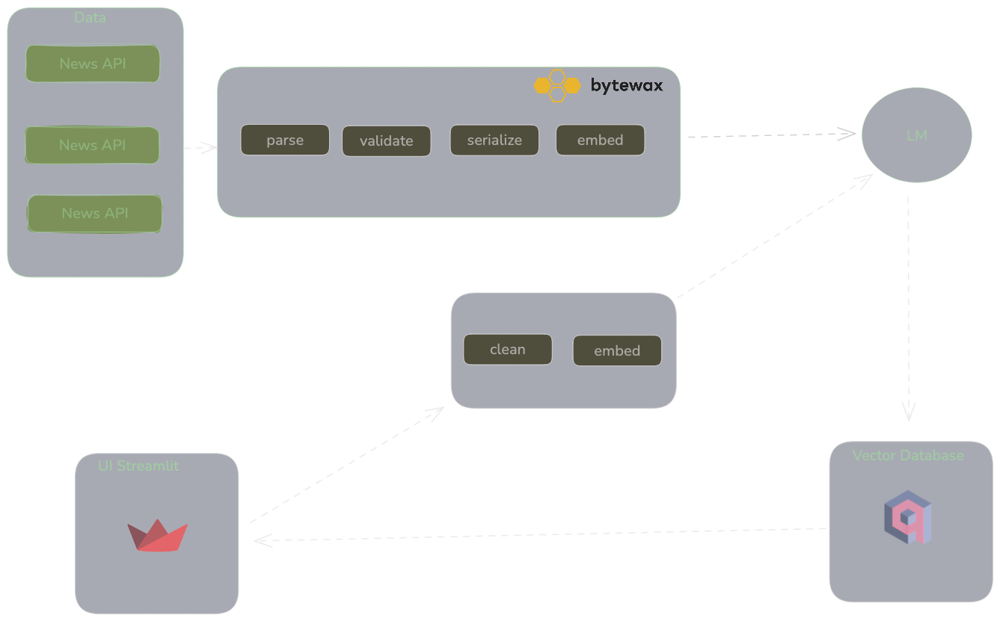

# news-search-engine

## Overview
This project is a real-time news search platform split into two main components:
1. **Backend**: Fetches and processes news articles from multiple sources, embedding them into a vector database using **Qdrant** for similarity search.
2. **Frontend**: Built with **Streamlit**, this interface allows users to query and retrieve the top 10 most relevant news articles based on their input.

The system integrates real-time streaming using **Bytewax**, vector-based similarity search with **Qdrant**, and flexible configuration management via **OmegaConf**.

## Flow

## Components

### Backend
The backend is responsible for:
- Fetching news from **NewsAPI** and **NewsDataAPI**.
- Standardizing the structure of news articles using **Pydantic** models.
- Embedding the cleaned text using **sentence-transformers/all-MiniLM-L6-v2** to create vector representations.
- Storing vectors in **Qdrant** for later retrieval based on user queries.

Bytewax Sources:

- For **REST APIs**: Use **FixedPartitionedSource** for partitioned data processing with recovery, or **SimplePollingSource** if you're polling data periodically from a single API endpoint.
- For **WebSocket**: If you need high-throughput parallel processing, use **DynamicSource**. If the WebSocket stream requires managing state (e.g., reconnecting after disconnection), consider **StatefulSourcePartition**.
- For **Polling**: Use **SimplePollingSource** when polling data at regular intervals from a REST API, especially if exact-once processing is needed.

### Frontend
The frontend is built using **Streamlit** and provides users with:
- A search bar where users input a query.
- The top 10 most relevant news articles displayed, based on vector similarity.
- Real-time results, with a custom layout that includes images, publication dates, and direct links to the original articles.

## Credits
- Qdrant 
- Bytewax
- DecodingML 
- DeepLearning.ai (Retrieval Optimization: From Tokenization to Vector Quantization)
